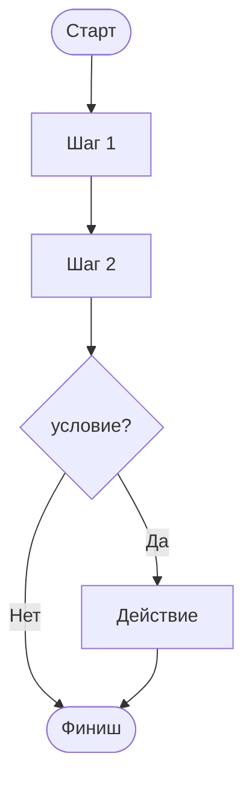

# WF Process Template

> 🤖 **Инструкция:** опиши процесс так, чтобы агент мог выполнить его шаг за шагом.

```yaml
---
file: '.memorybank/wfs/wf-[name].md'
description: '[что делает процесс]'
version: '1.0.0'
date: '[YYYY-MM-DD]'
status: 'ACTIVE'
---
```

# WF-[NAME]: [краткое описание]

## Диаграмма


## Шаги
### STEP-1: [Название]
- **Действие:** [что делаем]
- **Инструмент/агент:** [если применяется]
- **Результат:** [артефакт / проверка]

### STEP-2: ...

## Проверки по пути
- Если [условие] → [действие]
- Если [требуется помощь] → [какому процессу следовать]

## Завершение
- **Артефакты:** список файлов/обновлений
- **Обновить Memory Bank:** [какие файлы]
- **Отчёт:** [куда писать]

---
Соблюдай стиль из [WF overview](../wfs/index.md).
